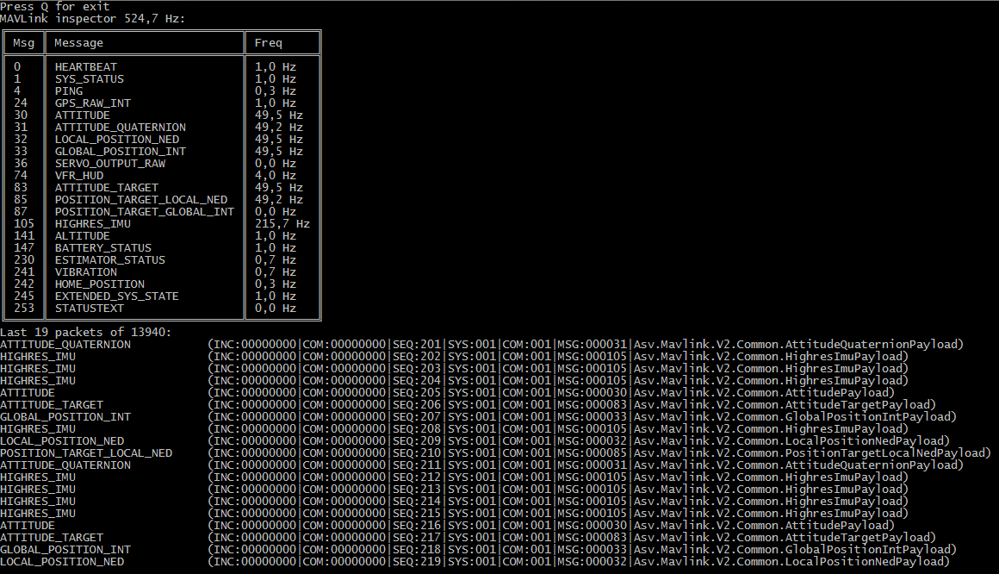
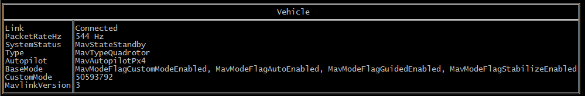
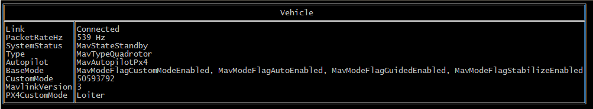

# mavshell.net

Mavlink shell tool, which use [MAVLink.net](https://github.com/asvol/mavlink.net) library.

Example:
```bash
mavshell-net.exe mavlink
```


```bash
mavshell-net.exe info
```

```bash
mavshell-net.exe px4info
```


## Versioning

Project is maintained under [the Semantic Versioning guidelines](http://semver.org/).


