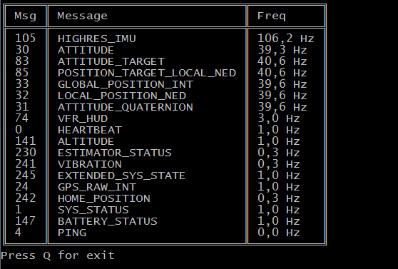

# mavshell.net

MAVLink shell tool.
Using [MAVLink.net](https://github.com/asvol/mavlink.net) library.

Example:
```bash
mavshell-net.exe listen
```
Output:



## Versioning

Project is maintained under [the Semantic Versioning guidelines](http://semver.org/).


