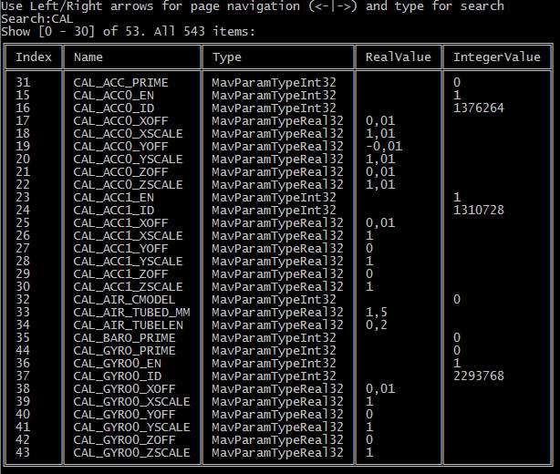

# mavshell.net

Mavlink shell tool, which use [MAVLink.net](https://github.com/asvol/mavlink.net) library.

Example:

### ### Listens to all MAVLink packets, groups it by message id and prints statistic: rate in seconds (Hz)
```
mavshell-net.exe mavlink
```


### Prints vehicle info

```
mavshell-net.exe info
```


### Prints extended PX4 vehicle info
```
mavshell-net.exe px4info
```


### Real time vehicle params with text search by name and page navigation.
mavshell-net.exe params



## Versioning

Project is maintained under [the Semantic Versioning guidelines](http://semver.org/).


